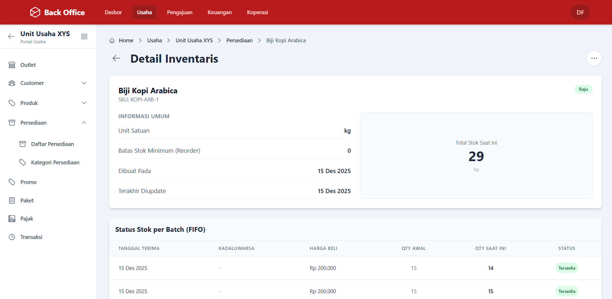

# Hi there, I'm Muhammad Rifky Alfian! 👋

### Fullstack Developer | PHP & JavaScript Enthusiast

Saya adalah pengembang web yang berfokus membangun aplikasi skalabel dengan efisiensi bisnis yang nyata. Berpengalaman menangani proyek freelance untuk instansi pemerintah (B2G) dan sektor swasta (B2B), mulai dari sistem manajemen kompleks hingga profil perusahaan.

<!--  -->

---

## 🛠 Tech Stack

Berikut adalah teknologi yang saya gunakan untuk membangun solusi:

<!-- GANTI BAGIAN INI SESUAI STACK ASLI ANDA. Hapus yang tidak perlu -->
**Frontend:**

**Backend:**

**Database & Tools:**

---

## 🚀 Featured Projects (Case Studies)

### 1. 🏦 Sistem ERP & Koperasi Terintegrasi (Project TNI)

**Klien: Koperasi Balai Sudirman / TNI**

> *Sistem ERP yang mengintegrasikan Point of Sales (Ritel), Simpan Pinjam, dan Payroll dengan **Financial Logic Engine** (Auto-Journaling ke Akuntansi).*

*(Screenshot: Dashboard Monitoring Stok & Keuangan)*

* **Masalah:** Ketidaksinkronan data antara kasir ritel, simpan pinjam, dan laporan keuangan manual.
* **Solusi:** Membangun sistem terpusat di mana setiap transaksi operasional otomatis menjurnal neraca & laba rugi (Real-time Accounting).
* **Tech Stack:** Laravel, MySQL (Stored Procedures), Vue.js.

👉 **[BACA STUDI KASUS LENGKAP & LOGIKA AKUNTANSI DI SINI](./projects/koperasi-tni.md)**
*(Klik link di atas untuk melihat alur Auto-Journaling dan Screenshot detail)*

---

### 2. Sistem Informasi Pengajuan Beasiswa Daerah

**Klien: Pemerintah Daerah Gorontalo**

> *Platform digitalisasi layanan publik untuk transparansi dan efisiensi penyaluran dana pendidikan.*

Membangun portal pendaftaran beasiswa yang menangani ribuan pengajuan data mahasiswa secara serentak (high traffic saat musim pendaftaran) dan workflow verifikasi bertingkat.

* **Fitur Kunci:**
  * **Workflow Approval:** Alur verifikasi berjenjang (Pemohon -> Verifikator -> Kadis -> Pencairan).
  * **Validasi Dokumen:** Upload dan pratinjau berkas (KTP, KTM, Transkrip) yang aman.
  * **Dashboard Monitoring:** Statistik real-time penyerapan anggaran beasiswa per kecamatan/jenjang pendidikan.
  * **Export Reporting:** Laporan otomatis format PDF/Excel untuk audit pemerintah.
* **Tech Stack:** [PHP Native / Laravel], MySQL, AJAX.

---

### 3. Corporate Profile & SEO Optimization

**Klien: CV. Sahid Teknik**

> *Membangun kredibilitas digital untuk perusahaan kontraktor teknik.*

Website profil perusahaan yang responsif dan dioptimasi untuk mesin pencari (SEO), bertujuan meningkatkan *lead generation* dari klien potensial.

* **Fitur Kunci:**
  * **Responsive Design:** Tampilan adaptif untuk Mobile, Tablet, dan Desktop.
  * **SEO Friendly:** Optimasi meta tags, sitemap, dan schema markup.
  * **Contact Form Integration:** Notifikasi langsung ke WhatsApp/Email admin saat ada pertanyaan proyek.
* **Tech Stack:** [Wordpress / Next.js / HTML5], CSS3, JavaScript.
* **Live Demo:** [Link Website Sahid Teknik]

---

## 📈 GitHub Stats

---

### 📫 Let's Connect

Saya terbuka untuk peluang kerja Fulltime maupun kerjasama proyek.

* **Email:** [email.anda@gmail.com]
* **LinkedIn:** [linkedin.com/in/namaanda]
