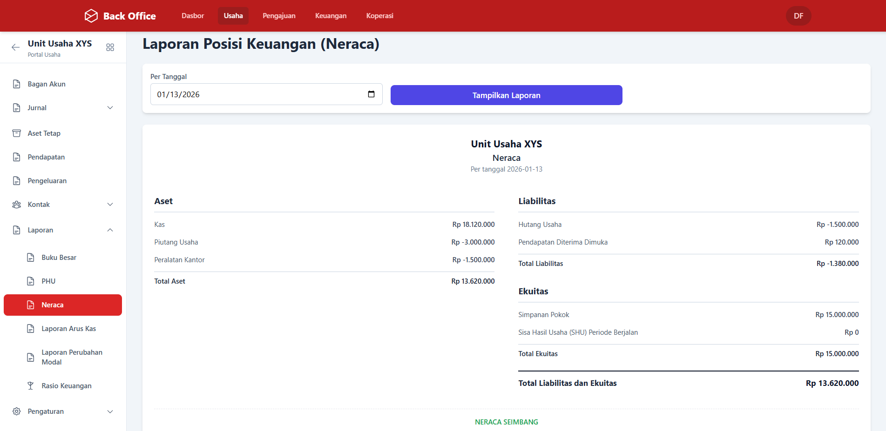
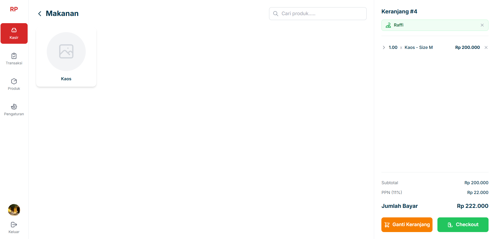
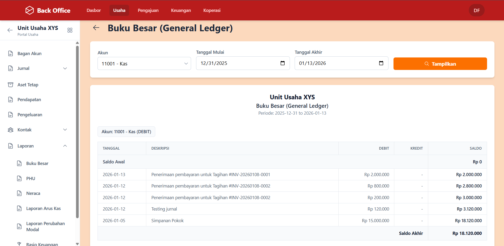

# 🏢 Enterprise Cooperative ERP & Integrated Financial System

> **Tipe Proyek:** Pengembangan Produk Sistem Informasi & ERP 
> **Status Implementasi:** Pilot Project / Production Stage 
> **Lokasi Pilot:** Koperasi TNI 
> **Role:** Lead Fullstack Developer

### 📖 Project Overview

Proyek ini adalah inisiatif pengembangan **Sistem Informasi Manajemen Terpadu** yang dirancang untuk memodernisasi ekosistem bisnis koperasi di Indonesia.

Sebagai tahap validasi awal (*Proof of Concept*), sistem ini diimplementasikan dalam skala **Pilot Project** di lingkungan **Koperasi TNI (Balai Sudirman)**. Lokasi ini dipilih karena memiliki kompleksitas operasional yang tinggi, mencakup unit Simpan Pinjam, Ritel (Minimarket), dan Jasa, sehingga menjadi tolak ukur yang ideal untuk menguji ketangguhan sistem.

**Tantangan Utama:**
Mengubah pola kerja konvensional yang terfragmentasi (antar unit usaha) menjadi ekosistem digital terpusat yang menjamin integritas data akuntansi dan efisiensi operasional.

---

### ⚙️ Arsitektur Sistem & Fitur Utama

Sistem ini dibangun dengan konsep **Multi-Tenancy** dan **Centralized Database**, memungkinkan Pengurus Pusat memantau performa seluruh unit usaha secara *real-time*.

#### 1. Core System Koperasi (Simpan Pinjam)

Modul inti untuk mendigitalkan siklus hidup keanggotaan.

* **Member Lifecycle:** Manajemen database anggota, profil digital, dan status keaktifan.
* **Financial Engine:** Kalkulasi otomatis bunga/bagi hasil untuk Simpanan (Wajib/Pokok/Sukarela) dan skema angsuran Pinjaman.
* **Secure Approval:** Workflow persetujuan berjenjang untuk pencairan dana.

#### 2. Retail ERP & Point of Sales (Unit Usaha)

Modul manajemen bisnis riil (Sektor Ritel/Toko) yang terintegrasi penuh.

* **Integrated POS:** Kasir front-end yang terhubung langsung dengan *Inventory Management* (Stok Opname & Alert System).
* **Asset Management:** Pencatatan aset tetap inventaris dengan fitur **Depreciation Scheduler** (Penghitung penyusutan nilai aset otomatis setiap akhir bulan).

#### 3. Human Resource & Payroll Automation

Sistem penggajian cerdas yang mengurangi beban administrasi HR.

* **Smart Sync Integration:** Sinkronisasi data dari mesin *fingerprint* fisik ke server cloud secara *real-time*.
* **Complex Payroll Logic:** Kalkulasi gaji otomatis yang memperhitungkan:
  * Log kehadiran & Keterlambatan.
  * Rumus Lembur (Overtime).
  * Potongan wajib (BPJS, PPh 21, Kasbon).

---

### 🧠 The "Financial Logic" Engine (Auto-Journaling)

Nilai jual utama dari pengembangan sistem ini adalah fitur **Otomasi Akuntansi**. Sistem dirancang untuk menerjemahkan aktivitas operasional menjadi jurnal akuntansi standar PSAK secara otomatis. Ini meminimalisir kebutuhan akan staf akuntan di setiap unit.

**Logika Pemrosesan Data:**

| Aktivitas User (Frontend) | Trigger Sistem | Eksekusi Jurnal Otomatis (Backend) |
| :--- | :--- | :--- |
| **Teller Terima Setoran** | Submit Transaksi | `(Dr) Kas`   `(Cr) Liabilitas Simpanan Anggota` |
| **Kasir Ritel Cetak Struk** | Transaksi Selesai | 1. `(Dr) Kas` & `(Cr) Pendapatan Penjualan`   2. `(Dr) HPP` & `(Cr) Persediaan` (Metode Perpetual) |
| **Procurement Beli Aset** | Approval PO | `(Dr) Aset Tetap`   `(Cr) Hutang Usaha / Kas` |
| **HR Finalisasi Gaji** | Payroll Run | `(Dr) Beban Gaji & Tunjangan`   `(Cr) Hutang Gaji / Bank` |

---

### 📸 Gallery & Implementation

<!-- Ganti LINK_GAMBAR di bawah dengan url gambar yang sudah diupload ke repo -->
| Dashboard Monitoring Stok | Laporan Keuangan (PHU) |
| :---: | :---: |
|  |  |
| *Real-time stock movement monitoring* | *Auto-generated Balance Sheet & Profit/Loss* |

| Point of Sales | General Ledger |
| :---: | :---: |
|  |  |
| *Kasir ritel terintegrasi* | *Drill-down detail per akun akuntansi* |

---

### 🚀 Business Impact

* **70% Efisiensi Waktu:** Memangkas waktu rekapitulasi manual administrasi.
* **Zero Human Error:** Mencegah kesalahan debit/kredit manual dalam pembukuan.
* **Transparansi:** Laporan Keuangan (Neraca/Laba Rugi) tersedia kapan saja (real-time) untuk keperluan Rapat Anggota Tahunan (RAT).

### 🛠 Tech Stack

* **Backend:** [Laravel], PostgreSQL (Complex Queries & Stored Procedures).
* **Frontend:** [React], Bootstrap/Tailwind.
* **Integration:** Fingerprint SDK, REST API.
