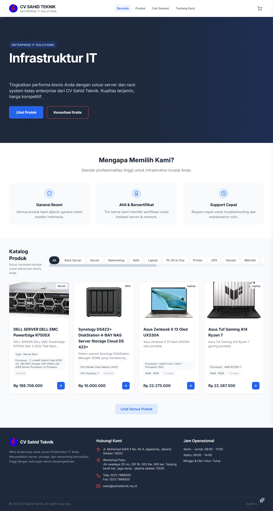
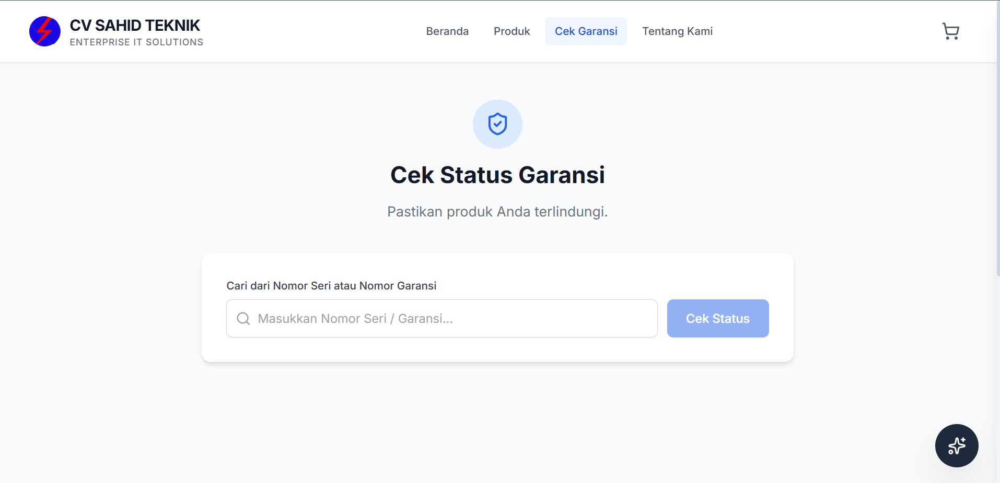
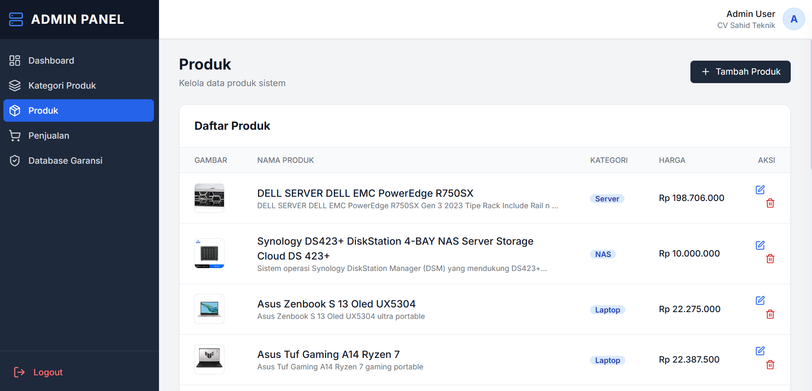
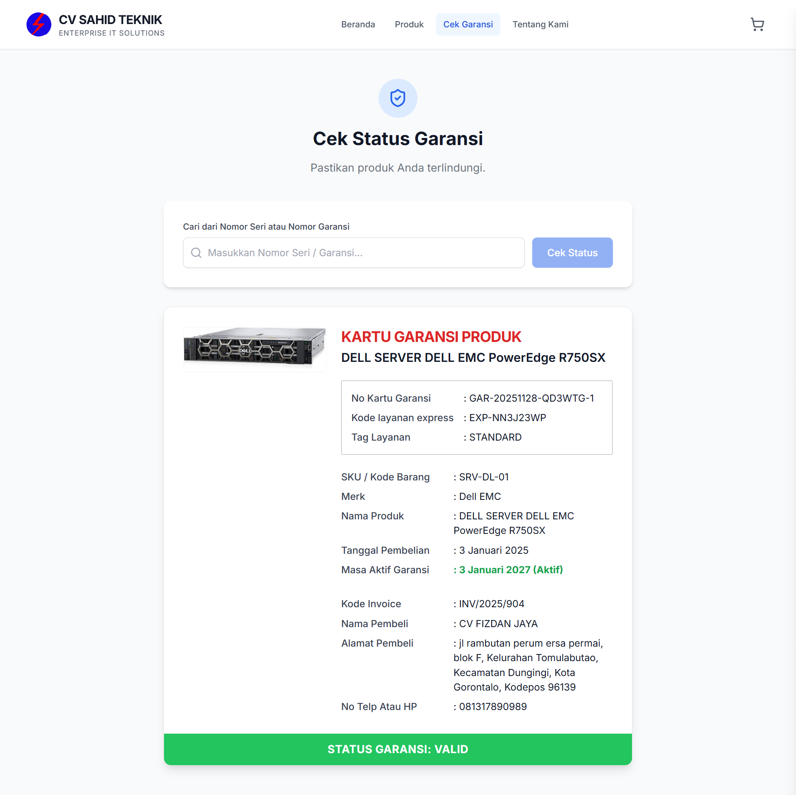

# 🛠️ Corporate CMS & Digital Warranty System (CV. Sahid Teknik)

> **Klien:** CV. Sahid Teknik (Kontraktor HVAC & Teknik)<br/>
> **Tipe:** Custom CMS & Customer Portal<br/>
> **Fokus Utama:** Digitalisasi Layanan Purna Jual (After-sales)<br/>
> **Role:** Fullstack Developer

### 📖 Executive Summary

Proyek ini adalah pengembangan platform digital terintegrasi untuk CV. Sahid Teknik. Klien membutuhkan lebih dari sekadar "brosur online"; mereka membutuhkan sistem untuk mengelola portofolio proyek secara mandiri dan membangun kepercayaan pelanggan melalui transparansi layanan.

**Masalah:**

1. **Trust Issue:** Klien kesulitan meyakinkan pelanggan baru tentang kredibilitas layanan teknis mereka.
2. **Tracking Garansi Manual:** Data garansi servis (AC/Mesin) dicatat di nota kertas yang sering hilang, menyebabkan sengketa dengan pelanggan saat klaim garansi.
3. **Ketergantungan Update:** Klien tidak bisa mengupdate foto proyek terbaru tanpa bantuan programmer.

**Solusi:**
Membangun **Custom CMS (Content Management System)** yang dilengkapi dengan **Modul Verifikasi Garansi Digital**. Admin dapat mengupdate konten website dan menginput data garansi, sementara pelanggan bisa melakukan pengecekan status garansi secara mandiri.

---

### ⚙️ Fitur Unggulan Sistem

#### 1. Digital Warranty Lookup Engine (Fitur Kunci)

Ini adalah fitur yang berfungsi untuk memeriksa status garansi produk pada CV. Sahid Teknik

* **Mekanisme:** Pelanggan memasukkan **Nomor Invoice** atau **Nomor Seri Unit** pada kolom pencarian di website.
* **Result:** Sistem menampilkan detail pengerjaan, tanggal servis, durasi garansi, dan status real-time (**Aktif** atau **Expired**).
* **Manfaat:** Mengurangi beban telepon ke admin hanya untuk menanyakan masa berlaku garansi.

#### 2. Dynamic Project Portfolio (CMS)

Admin memiliki dashboard khusus untuk mengelola konten tanpa menyentuh kode (No-Code Content Management).

* **CRUD Projects:** Tambah/Edit/Hapus foto produk.

#### 3. Lead Generation Optimized

Desain UX difokuskan untuk konversi pengunjung menjadi klien.

* **Fast Call-to-Action (CTA):** Tombol WhatsApp melayang yang terintegrasi dengan pesan template otomatis ("Halo Sahid Teknik, saya ingin konsultasi...").
* **Mobile-First Design:** Dioptimalkan untuk akses via smartphone, mengingat 80% pencarian jasa teknik dilakukan lewat HP.

---

### 🧠 Logic: Alur Verifikasi Garansi

Fitur ini menggunakan logika pencarian database dan perbandingan tanggal (*date comparison*).

**Skenario Penggunaan:**

1. **Input Admin:**
    Saat pekerjaan selesai, Admin input data ke CMS:
    * ID Pelanggan: `CUST-001`
    * Tanggal Servis: `01-Jan-2025`
    * Masa Garansi: `90 Hari`
    * *System Logic:* Otomatis set `Expired_Date` = `01-Apr-2025`.

2. **Pengecekan User (Frontend):**
    User input No Nota. Sistem menjalankan *query*:

    ```sql
    SELECT * FROM warranties WHERE invoice_no = 'INPUT_USER'
    ```

3. **Logika Tampilan (Output):**
    * **IF** `Today` < `Expired_Date`: Tampilkan Badge Hijau **"GARANSI AKTIF"** + Hitung sisa hari.
    * **IF** `Today` > `Expired_Date`: Tampilkan Badge Merah **"MASA GARANSI BERAKHIR"**.

---

### 📸 Interface & Implementasi

<!-- GANTI DENGAN LINK GAMBAR SCREENSHOT YANG ADA DI FOLDER REPO ANDA -->
| Halaman Depan & Portfolio | Fitur Cek Garansi (User) |
| :---: | :---: |
|  |  |
| *Desain modern dan SEO friendly* | *Input nomor nota untuk tracking* |

| Dashboard Admin (CMS) | Hasil Pengecekan (Status) |
| :---: | :---: |
|  |  |
| *Admin panel untuk input data garansi* | *Tampilan status garansi transparan* |

---

### 🚀 Dampak Bisnis

* **Peningkatan Kredibilitas:** Fitur cek garansi meningkatkan persepsi profesionalitas perusahaan di mata pelanggan korporat.
* **Efisiensi Data:** Tidak ada lagi tumpukan nota fisik; semua riwayat servis tersimpan digital.
* **Marketing Organik:** Website kini menduduki peringkat atas pencarian lokal berkat struktur CMS yang SEO-friendly.

### 🛠 Tech Stack

* **Core:** [Laravel].
* **Database:** MySQL.
* **Frontend:** HTML5, CSS3, React.js.
* **Server:** Shared Hosting / cPanel.
