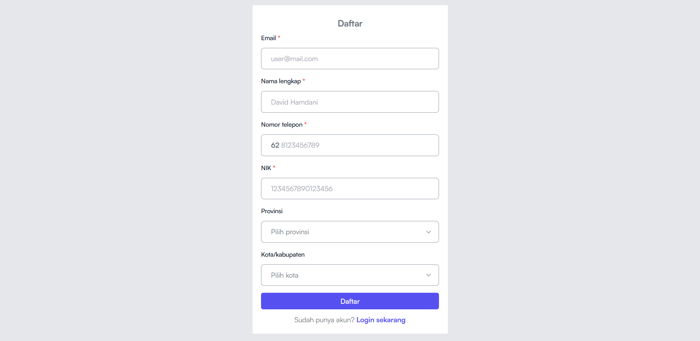
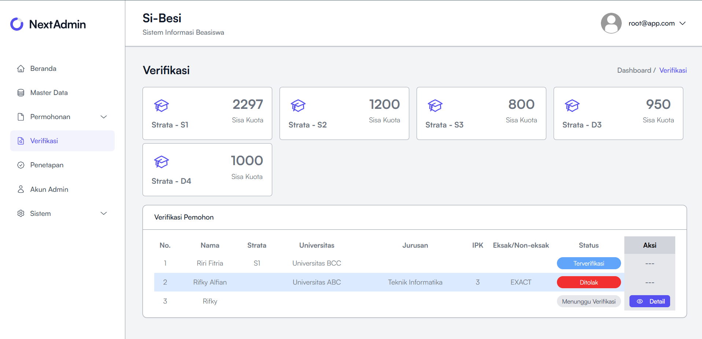

# 🎓 Sistem Informasi Manajemen Beasiswa Daerah (e-Beasiswa)

> **Klien:** Pemerintah Daerah (Pemda) Gorontalo 
> **Kategori:** G2C (Government to Citizen) / Public Service 
> **Status:** Private Repository (Government IP) 
> **Role:** Fullstack Developer

### 📖 Executive Summary

Proyek ini adalah transformasi digital untuk proses penyaluran dana pendidikan daerah. Sebelumnya, ribuan mahasiswa harus datang membawa berkas fisik, menyebabkan antrean panjang, penumpukan dokumen, dan proses seleksi manual yang memakan waktu berbulan-bulan.

**Tantangan Utama:**

1. **High Concurrency:** Ribuan mahasiswa mengakses sistem secara bersamaan pada minggu-minggu terakhir penutupan (traffic spike).
2. **Complex Bureaucracy:** Alur persetujuan melibatkan banyak meja (Verifikator -> Kasubag -> Kepala Dinas -> Keuangan).
3. **Data Integrity:** Mencegah duplikasi penerima bantuan (double funding).

**Solusi:**
Membangun platform terpusat berbasis web yang menangani seluruh siklus beasiswa, mulai dari pendaftaran, validasi berkas otomatis, hingga *tracking* status pencairan dana secara transparan.

---

### ⚙️ Fitur Unggulan & Arsitektur Sistem

#### 1. Multi-Tier Approval Workflow (Digitalisasi Birokrasi)

Sistem ini memetakan birokrasi manual ke dalam logika aplikasi dengan sistem *Role-Based Access Control* (RBAC) yang ketat.

* **Tahap 1 (Applicant):** Mahasiswa upload berkas (KTP, KTM, Transkrip, Surat Aktif Kuliah).
* **Tahap 2 (Verifikator Admin):** Validasi kelengkapan dokumen (Format Checking).
* **Tahap 3 (Komite Seleksi):** Scoring otomatis berdasarkan IPK dan kondisi ekonomi (Sorting Algoritma).
* **Tahap 4 (Kepala Dinas):** *Digital Approval* untuk penerbitan SK Penerima.
* **Tahap 5 (Finance):** Integrasi data rekening untuk pencairan.

#### 2. Mekanisme "High Traffic" Handling

Karena pendaftaran dibuka dalam jendela waktu terbatas (seasonal), server sering mengalami lonjakan beban.

* **Optimasi Query:** Menggunakan *Eager Loading* untuk mencegah masalah N+1 Query saat menampilkan ribuan data pendaftar.
* **Queue System:** Menggunakan antrean (Jobs/Queues) untuk proses berat seperti *Generate PDF Laporan* atau *Email Notification*, sehingga UI tidak *freeze* saat diakses banyak user.

#### 3. Real-time Tracking & Transparency

Fitur "Cek Status" yang memungkinkan mahasiswa memantau posisi berkas mereka secara *real-time* (mirip tracking paket kurir), mengurangi beban CS/Admin menjawab pertanyaan "Kapan cair?".

---

### 💻 Technical Deep Dive: Validasi & Keamanan

Keamanan data adalah prioritas utama dalam aplikasi pemerintahan.

| Isu Keamanan | Solusi Teknis |
| :--- | :--- |
| **Manipulasi File** | Sistem memvalidasi *MIME Type* file (bukan hanya ekstensi) untuk memastikan yang diupload benar-benar PDF/JPG, bukan script berbahaya (PHP Shell). |
| **Double Funding** | Logika pengecekan NIK dan NIM lintas periode. Sistem otomatis menolak jika NIK tersebut sudah pernah menerima bantuan di periode yang sama. |
| **SQL Injection** | Menggunakan *Prepared Statements* (via Eloquent ORM/Query Builder) untuk memfilter input data mahasiswa. |

---

### 📸 Gambaran Interface

<!-- GANTI DENGAN LINK GAMBAR SCREENSHOT YANG ADA DI FOLDER REPO ANDA -->
| Portal Pendaftaran (Mahasiswa) | Dashboard Verifikator (Pemda) |
| :---: | :---: |
|  |  |
| *UI Pendaftaran yang responsif & clean* | *Panel validasi berkas split-screen* |

| Tracking Status  |
| :---: |
|  |
| *Transparansi alur verifikasi* |

---

### 🚀 Dampak Implementasi (Impact)

* **Paperless:** Mengurangi penggunaan ribuan lembar kertas per semester.
* **Kecepatan Proses:** Memangkas waktu seleksi dari **3 bulan menjadi 3 minggu**.
* **Transparansi Publik:** Menghilangkan persepsi "Orang Dalam" karena semua status penolakan disertai alasan yang jelas di sistem.

### 🛠 Tech Stack

* **Backend:** [Laravel], SQL Server.
* **Frontend:** [React], Tailwind.
* **Server:** Linux (Ubuntu/CentOS), Nginx.
* **Tools:** PDF Generator (DomPDF), Excel Export.
